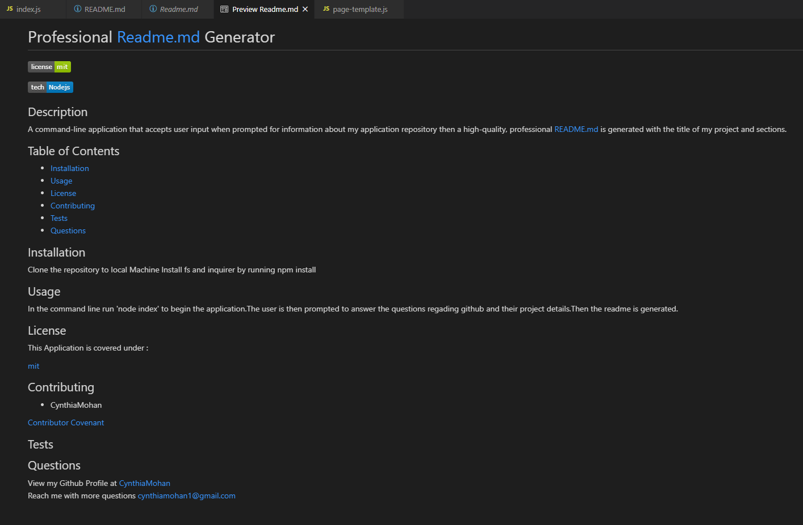

# Professional Readme.md Generator

## Description
A command-line application that accepts user input when prompted for information about my application repository then a high-quality, professional README.md is generated with the title of my project and sections. 

## Table of Contents 

* [Installation](#installation)
* [Usage](#usage)
* [License](#license)
* [Contributing](#contributing)
* [Screenshots](#screenshots)
* [Questions](#questions)

## Installation
1. Clone the repository to local Machine 
2. Install fs and inquirer by running npm install 

## Usage 
In the command line run 'node index' to begin the application.The user is then prompted to answer the questions regading github and their project details.Then the readme is generated.
 
 
View the video here: https://youtu.be/E44Wp7omc0I
 
 

## License

This Application is covered under : 

[mit](https://choosealicense.com/licenses/mit)
 

## Contributing

* CynthiaMohan 

[Contributor Covenant](https://www.contributor-covenant.org/)

## Screenshots

## Questions
View my Github Profile at [CynthiaMohan](http://github.com/CynthiaMohan)
 
Reach me with more questions <cynthiamohan1@gmail.com>

